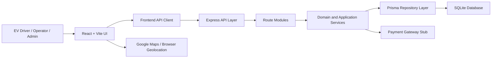

# Architecture Report - EV Charging Station Network Management Prototype

## 1. Architecture Overview

This prototype is designed as a web-based information system. According to the architecture lecture material, information systems commonly use a layered architecture and are often implemented as multi-tier client-server systems. The project follows a hybrid architecture:

- Multi-tier client-server: React browser client, Express API server, Prisma/SQLite data tier.
- Layered architecture: UI layer, API/routing layer, application/domain service layer, repository/data access layer.
- Repository/data-centered pattern: all persistent data is stored in the central SQLite database through Prisma models.
- MVC-inspired separation: React components act as View/interaction, Express routes act as Controllers, Prisma/domain models act as Model.

The design is not a new experimental architecture. It is a practical hybrid of established patterns from the course slides, adapted for a small prototype.

### Block Diagram

### Main Components and Subsystems

| Architecture Component | Responsibility | Implementation |
| --- | --- | --- |
| Browser UI layer | Presents workflows and handles user interaction | `src/App.tsx`, `src/features/*`, `src/components/common.tsx` |
| Map/UI integration | Shows stations, markers, route entry point, fallback map | `src/MapView.tsx`, `src/features/reservation/ReserveStep.tsx` |
| API/routing layer | Exposes REST endpoints grouped by subsystem | `server/app.ts`, `server/routes/*` |
| Application services | RBAC, audit, notifications, reports, reservation settlement, station availability | `server/services/*` |
| Domain rules | Validation, money conversion, reservation rules, session cost calculation | `server/domain.ts`, `src/shared/*` |
| Repository/data layer | Persistent storage and relationships | `prisma/schema.prisma`, `server/db.ts` |
| Seed/demo data | Stable demo users, stations, chargers, wallet, audit baseline | `server/seedData.ts` |
| Automated testing | Development/release confidence for main workflows | `tests/api.test.ts`, `tests/domain.test.ts` |

### Subsystem Mapping

| Subsystem | UI Module | API Module | Service/Domain Support | DB Models | Related Requirements |
| --- | --- | --- | --- | --- | --- |
| Vehicle Registration | `features/vehicle/VehicleStep.tsx` | `routes/vehicles.ts` | `domain.ts` vehicle validation | `User`, `Vehicle` | EDR-01, EDR-02, SDR-01 |
| Map and Reservation | `features/reservation/ReserveStep.tsx`, `MapView.tsx` | `routes/system.ts`, `routes/reservations.ts` | `services/stations.ts`, `services/reservations.ts`, reservation rules | `ChargingStation`, `Charger`, `Reservation`, `Wallet` | EDR-03..08, EDR-15, MNS-01..07 |
| Charging Session | `features/charging/ChargeStep.tsx` | `routes/sessions.ts` | `services/sessions.ts`, session cost calculation | `ChargingSession`, `Reservation`, `Transaction` | EDR-09, EDR-17, EDR-18, PWS-02, PWS-08 |
| Wallet and Receipts | `features/wallet/WalletStep.tsx` | `routes/wallet.ts` | money conversion, receipt generation | `Wallet`, `Transaction` | PWS-01..07, GRR-01..04 |
| Operator Maintenance | `features/operations/OpsStep.tsx` | `routes/operator.ts`, `routes/issues.ts` | notifications, reservation refund/release | `Charger`, `ChargingStation`, `IssueReport`, `Notification` | SOR-01..06, EDR-12 |
| Admin Reporting | `features/operations/OpsStep.tsx` | `routes/admin.ts`, `routes/reports.ts` | `services/reports.ts` | `User`, `Reservation`, `ChargingSession`, `IssueReport`, `Transaction` | ADR-01..08 |
| Security and Audit | `features/evidence/EvidenceStep.tsx` | `routes/security.ts`, `routes/audit.ts` | `services/auth.ts`, `services/audit.ts` | `AuditLog`, `FailedLoginAttempt`, `User` | SDR-01..05, ADR-06, ADR-07 |

### How Components Are Interconnected

The user interacts with React screens. The frontend sends JSON requests with demo role and user headers. Express receives these requests and routes them to subsystem modules. Routes validate input, call shared services and domain rules, then read/write data through Prisma. Prisma manages all database access to SQLite. After data changes, service functions create notifications and audit records, so cross-cutting behavior is centralized.

Example flow for UC-2:

1. `ReserveStep` displays station markers and available slots.
2. The UI calls `/api/reservations`.
3. `routes/reservations.ts` validates request data and user scope.
4. `server/domain.ts` checks compatibility, operating hours, 2-hour limit, 24-hour limit, double booking and wallet sufficiency.
5. Prisma creates a reservation, wallet hold and transaction in SQLite.
6. Notification and audit services record the event.
7. The frontend refreshes bootstrap data and shows confirmation.

### Architecture Design to Implementation Connection

The theoretical architecture becomes practical in the codebase as follows:

- Layered architecture: UI components do not directly access Prisma; they call REST endpoints.
- Client-server architecture: `src/features/*` runs in the browser, while `server/routes/*` runs in Node/Express.
- Repository pattern: all persistent state is centralized in Prisma/SQLite instead of being duplicated in each subsystem.
- Domain separation: cost calculation, reservation rules and validation live in `server/domain.ts`, not inside UI components.
- Cross-cutting concerns: RBAC, audit hash-chain, notifications and reporting are services under `server/services/*`.

## 2. UI Design Overview

The UI is built as an operational dashboard rather than a marketing page. This fits the system domain because EV drivers, operators and admins need fast repeated actions, readable status, and clear feedback.

### UI Criteria Applied

| Criterion | Implementation Evidence |
| --- | --- |
| Consistent navigation | Sidebar navigation groups driver, operator and system workflows in `App.tsx`. |
| Role-based interaction | Role switch and account switch expose driver/operator/admin views while protected APIs still enforce RBAC. |
| Readable information presentation | Cards, metrics, tables and status pills show balance, station status, reservations, reports and audit records. |
| Appropriate controls | Selects for role/status/charger, buttons for commands, sliders for SoC, inputs for numeric values, checkbox toggles for simulations. |
| Same-page validation and feedback | UI disables invalid reservation actions and API errors appear in the notice panel. |
| Map-oriented station finding | `MapView.tsx` uses Google Maps when configured and a fallback map when no key is available. |
| Transparency for financial actions | Wallet, transaction history, receipt numbers, refund results and charging history are visible in the wallet screen. |

### UI Examples for Presentation

- Vehicle screen: demonstrates vehicle registration, connector type and validation.
- Find Charger screen: demonstrates station map, filters, color-coded availability, route link, estimated cost and wallet sufficiency.
- Charging screen: demonstrates start session, live energy/cost estimate, target SoC, sync recovery and safe stop warnings.
- Wallet screen: demonstrates top-up stub, transaction history, receipts, favorites and notifications.
- Operations screen: demonstrates charger status update, station configuration, issue management, reports and admin user/station management.
- Activity screen: demonstrates audit evidence and compliance controls.

## 3. Testing Overview

The test strategy combines domain rule tests and API workflow tests. This matches the assignment requirement that test cases should be related to the specified main use cases.

| Test Area | Test File | Inputs / Scenario | Expected Output |
| --- | --- | --- | --- |
| UC-1 Vehicle registration | `tests/api.test.ts`, `tests/domain.test.ts` | Tesla Model 3, 75 kWh, CCS, 35 EV 2024 | Vehicle saved; invalid/duplicate plate rejected |
| UC-2 Reservation workflow | `tests/api.test.ts` | Karsiyaka Hub, DC 50kW #03, compatible CCS vehicle | Reservation confirmed; route-ready record; reserved windows exposed without PII |
| Reservation exceptions | `tests/api.test.ts`, `tests/domain.test.ts` | Incompatible connector, overlapping booking, outside 24h window, over 2h duration | API rejects request with clear error |
| UC-3 Charging processing | `tests/api.test.ts`, `tests/domain.test.ts` | Start 20%, end 80%, 75 kWh battery, 4 TL/kWh | 45 kWh consumed; 180 TL cost; receipt generated |
| Wallet and refund | `tests/api.test.ts` | Cancellation, low balance, mid-session depletion | Refund transaction created; safe stop and notification created |
| Operator workflow | `tests/api.test.ts` | Mark charger out of service | Affected reservations cancelled and users notified |
| Admin workflow | `tests/api.test.ts` | Reports, user updates, station add/remove | Admin-only endpoints work and non-admin roles are blocked |
| Security and audit | `tests/api.test.ts` | Unauthorized access, failed-login simulation, audit read | RBAC blocks access; admin alert and valid audit hash-chain |

### Verification Results

Latest verification after the modular refactor:

- `npx tsc --noEmit`: passed.
- `npx vitest run`: passed, 29 tests.
- `npx vite build`: passed.
- `npm test`: blocked at `prisma generate` with Windows `query_engine-windows.dll.node` rename EPERM.
- `npm run build`: blocked at the same `prisma generate` DLL rename EPERM.

The failing top-level commands fail before application tests/build logic. The direct TypeScript, Vitest and Vite commands pass. The likely cause is a local Windows Prisma query engine file lock from running Node/Prisma processes. Closing existing dev API/test Node processes and rerunning `prisma generate` should clear it.

## 4. Prototype Demonstration Flow

The demo should follow the assignment's required use case:

1. Register vehicle: Tesla Model 3, 75 kWh, CCS, plate 35 EV 2024.
2. Open Find Charger and show stations around the demo/current location.
3. Filter/select Karsiyaka Hub and choose DC 50kW #03.
4. Show compatibility, route link, estimated cost and wallet sufficiency.
5. Create reservation.
6. Start charging from the confirmed reservation with start SoC 20% and target SoC 80%.
7. Complete session at 80%.
8. Show 45 kWh, 180 TL, wallet transaction, receipt, charging history, notification and audit entry.
9. Switch to operator/admin to show charger status management, reports and RBAC.

## 5. Prototype Limitations

These are intentional prototype boundaries and should be explained honestly:

- Payment gateway is a secure-payment stub, not a real bank/payment provider integration.
- TLS 1.2+ is documented as a deployment/compliance control; local development runs on HTTP.
- Login is simulated through demo account switching and headers; it is not production authentication.
- Google Maps runs when a key is configured; otherwise the app shows a compatible fallback map.
- Charging progress is simulated/projected from SoC, battery capacity, power and wallet balance; it is not connected to a real charger telemetry feed.
- 99.5% availability is presented as a KPI/target, not measured from production monitoring data.

## 6. Short Slide Notes

- Slide 1: The system is a web-based information system using hybrid client-server, layered and repository patterns.
- Slide 2: React handles presentation and interaction; Express routes handle API requests; services enforce business rules; Prisma centralizes data access.
- Slide 3: Main subsystems are Vehicle, Map/Reservation, Charging, Wallet, Operator Maintenance, Admin Reporting, Security/Audit.
- Slide 4: The architecture is traceable to implementation through `src/features/*`, `server/routes/*`, `server/services/*`, and `prisma/schema.prisma`.
- Slide 5: Testing covers UC-1, UC-2 and UC-3 plus exceptions, RBAC, reporting, refunds, notifications and audit integrity.
